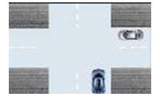
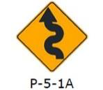
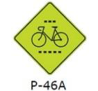
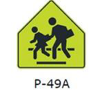
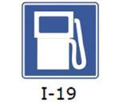

# Выборка 10 вопросов A1 для проверки (seed=1)

## 17. Está prohibido estacionar un vehículo:

- Тема: `estacionamiento` · Тип ответа: `all` · PDF стр. 2
- Якоря вопроса: prohibido estacionar
- Якоря ответа: — (нет, см. trap)
- Термины: estacionar, curva, interseccion, garaje, zona-militar

- **a)** En las curvas.  
  RU: На поворотах.  
  EN: On curves.
- **b)** Dentro de una intersección.  
  RU: На перекрёстке.  
  EN: Inside an intersection.
- **c)** Frente a la entrada de garajes y de recintos militares o policiales.  
  RU: Перед въездом в гаражи и на военные или полицейские объекты.  
  EN: In front of the entrance to garages and military or police premises.
- **d)** Todas las alternativas son correctas. ✅  
  RU: Все варианты верны.  
  EN: All of the options are correct.

**RU:** Запрещено ставить автомобиль на стоянку:  
**EN:** It is prohibited to park a vehicle:

**Gist:** Где запрещена стоянка / Where parking is prohibited

**Объяснение (RU):** Все три места из списка — запрещённые для стоянки. Поворот: вас не видно. Перекрёсток: мешаете движению. Въезд в гараж или военный объект: блокируете проезд.

**Explanation (EN):** All three places listed are no-parking places. A curve: you cannot be seen. An intersection: you block traffic. A garage or military entrance: you block access.

**Ловушка (RU):** Каждый из вариантов a, b, c верен сам по себе. Когда все верны — выбирайте «Todas las alternativas son correctas» (все варианты верны).

**Подстрочник (RU):**

- Вопрос: **Está prohibido estacionar**⚠ _Запрещено парковать_ · **un vehículo:** _автомобиль:_
- a) **En las curvas.** _На поворотах._
- b) **Dentro de una intersección.** _На перекрёстке._
- c) **Frente a la entrada** _Перед въездом_ · **de garajes** _в гаражи_ · **y de recintos militares o policiales.** _и на военные или полицейские объекты._
- d) **Todas las alternativas**⚠ _Все варианты_ · **son correctas.** _верны._

## 31. Si usted se aproxima a una señal de PARE colocada verticalmente o pintada en la vía, la acción correcta es:

- Тема: `senales` · Тип ответа: `text` · PDF стр. 4
- Якоря вопроса: señal de PARE, acción correcta
- Якоря ответа: por completo, preferencia
- Термины: pare, parar, ceder-el-paso, preferencia-de-paso, via, transversal, disminuir, velocidad

- **a)** Disminuir su velocidad y cederle el paso a los vehículos que circulan por la transversal.  
  RU: Снизить скорость и уступить дорогу машинам, которые едут по поперечной дороге.  
  EN: Reduce your speed and give way to the vehicles travelling on the cross road.
- **b)** Disminuir su velocidad y pasar con cuidado.  
  RU: Снизить скорость и проехать осторожно.  
  EN: Reduce your speed and pass carefully.
- **c)** Sobre parar y pasar rápidamente.  
  RU: Притормозить и быстро проехать.  
  EN: Slow almost to a stop and pass quickly.
- **d)** Parar por completo, ceder el paso a los usuarios que tengan preferencia y luego continuar con precaución. ✅  
  RU: Полностью остановиться, уступить дорогу тем, у кого приоритет, а затем осторожно продолжить движение.  
  EN: Stop completely, give way to the users who have priority, and then continue with caution.

**RU:** Если вы приближаетесь к знаку PARE (стоп), установленному вертикально или нарисованному на дороге, правильное действие:  
**EN:** If you approach a STOP (PARE) sign placed vertically or painted on the road, the correct action is:

**Gist:** Что делать у знака PARE / What to do at a PARE sign

**Объяснение (RU):** PARE значит «стоп»: нужно остановиться полностью. Потом уступить дорогу тем, у кого приоритет. Только после этого ехать дальше. Просто снизить скорость — недостаточно.

**Explanation (EN):** PARE means stop: you must stop completely. Then give way to those who have priority. Only after that drive on. Just slowing down is not enough.

**Ловушка (RU):** Варианты a и b говорят «disminuir su velocidad» (снизить скорость). Этого мало: нужно «parar por completo» (полностью остановиться).

**Подстрочник (RU):**

- Вопрос: **Si usted se aproxima a** _Если вы приближаетесь к_ · **una señal de PARE** _знаку PARE (стоп),_ · **colocada verticalmente** _установленному вертикально_ · **o pintada en la vía,** _или нарисованному на дороге,_ · **la acción correcta es:** _правильное действие:_
- a) **Disminuir su velocidad** _Снизить скорость_ · **y cederle el paso** _и уступить дорогу_ · **a los vehículos que circulan** _машинам, которые едут_ · **por la transversal.** _по поперечной дороге._
- b) **Disminuir su velocidad** _Снизить скорость_ · **y pasar con cuidado.** _и проехать осторожно._
- c) **Sobre parar** _Притормозить_ · **y pasar rápidamente.** _и быстро проехать._
- d) **Parar por completo,**★ _Полностью остановиться,_ · **ceder el paso a los usuarios** _уступить дорогу участникам,_ · **que tengan preferencia**★ _у которых приоритет,_ · **y luego continuar**⚠ _а затем продолжить_ · **con precaución.** _осторожно._

## 35. Si dos vehículos se aproximan simultáneamente a una intersección no regulada (sin señalización) procedentes de vías diferentes, ¿quién tiene preferencia de paso?

- Тема: `preferencia` · Тип ответа: `text` · PDF стр. 4
- Якоря вопроса: dos vehículos, simultáneamente, vías diferentes
- Якоря ответа: derecha
- Термины: interseccion, preferencia-de-paso, bocina, senalizar

- **a)** Cualquiera de los dos.  
  RU: Любой из двух.  
  EN: Either of the two.
- **b)** El que se aproxime por la derecha del otro. ✅  
  RU: Тот, кто подъезжает справа от другого.  
  EN: The one approaching from the right of the other.
- **c)** El que se aproxime por la izquierda del otro.  
  RU: Тот, кто подъезжает слева от другого.  
  EN: The one approaching from the left of the other.
- **d)** El que haga sonar la bocina primero.  
  RU: Тот, кто первым посигналит.  
  EN: The one who sounds the horn first.

**RU:** Если два автомобиля одновременно подъезжают к нерегулируемому перекрёстку (без знаков) с разных дорог, у кого приоритет проезда?  
**EN:** If two vehicles approach an unregulated intersection (no signs) simultaneously from different roads, who has right of way?

**Gist:** Кто проезжает первым без знаков / Who goes first with no signs

**Объяснение (RU):** Работает правило «помеха справа». Приоритет у того, кто едет справа от вас. Вы уступаете тому, кто справа. Сигнал клаксоном приоритета не даёт.

**Explanation (EN):** The rule is: priority to the right. The vehicle on your right has priority. You give way to it. Sounding the horn gives no priority.

**Ловушка (RU):** Варианты b и c отличаются одним словом: «derecha» (справа) — верно, «izquierda» (слева) — нет.

**Подстрочник (RU):**

- Вопрос: **Si dos vehículos se aproximan** _Если два автомобиля подъезжают_ · **simultáneamente a una intersección** _одновременно к перекрёстку,_ · **no regulada (sin señalización)**⚠ _нерегулируемому (без знаков),_ · **procedentes de vías diferentes,** _с разных дорог,_ · **¿quién tiene preferencia de paso?** _у кого приоритет проезда?_
- a) **Cualquiera de los dos.** _Любой из двух._
- b) **El que se aproxime** _Тот, кто подъезжает_ · **por la derecha del otro.**★ _справа от другого._
- c) **El que se aproxime** _Тот, кто подъезжает_ · **por la izquierda del otro.**⚠ _слева от другого._
- d) **El que haga sonar** _Тот, кто подаст_ · **la bocina primero.** _сигнал первым._

## 66. Si una licencia de conducir consiga alguna restricción, es correcto afirmar que:

- Тема: `documentos` · Тип ответа: `text` · PDF стр. 6
- Якоря вопроса: licencia de conducir, restricción
- Якоря ответа: una obligación
- Термины: licencia-de-conducir, restriccion, seguridad-vial

- **a)** Dicha restricción es meramente informativa.  
  RU: Это ограничение — просто для информации.  
  EN: That restriction is merely informative.
- **b)** Es una obligación cumplir con la restricción. ✅  
  RU: Соблюдать ограничение обязательно.  
  EN: It is mandatory to comply with the restriction.
- **c)** Incumplir la restricción no genera un riesgo para la seguridad vial.  
  RU: Нарушение ограничения не создаёт риска для безопасности движения.  
  EN: Breaking the restriction creates no road safety risk.
- **d)** Ninguna de las alternativas es correcta.  
  RU: Ни один вариант не верен.  
  EN: None of the options is correct.

**RU:** Если в водительских правах указано ограничение, верно, что:  
**EN:** If a driving licence has a restriction noted, it is correct to say that:

**Gist:** Ограничение в правах обязательно / Licence restriction must be followed

**Объяснение (RU):** Ограничение в правах (например, «очки») нужно соблюдать. Это обязанность, а не совет. Нарушение — это риск и штраф.

**Explanation (EN):** A restriction on the licence (for example "glasses") must be followed. It is a duty, not advice. Breaking it is a risk and an offence.

**Подстрочник (RU):**

- Вопрос: **Si una licencia de conducir** _Если водительские права_ · **consiga alguna restricción,** _содержат какое-то ограничение,_ · **es correcto afirmar que:** _верно утверждать, что:_
- a) **Dicha restricción** _Это ограничение_ · **es meramente informativa.** _просто информационное._
- b) **Es una obligación**★ _Это обязанность_ · **cumplir con la restricción.** _соблюдать ограничение._
- c) **Incumplir la restricción** _Нарушение ограничения_ · **no genera un riesgo**⚠ _не создаёт риска_ · **para la seguridad vial.** _для безопасности движения._
- d) **Ninguna de las alternativas**⚠ _Ни один из вариантов_ · **es correcta.** _не верен._

## 116. La siguiente señal (P-5-1a) , le advierte al conductor que:

- Тема: `senales` · Тип ответа: `text` · PDF стр. 12
- Якоря вопроса: P-5-1a, le advierte
- Якоря ответа: sinuoso a la izquierda
- Термины: senal, curva, sinuoso, aproximarse
- Двойники: a1-117, a1-118

- **a)** Se aproxima a una curva y contra-curva a la izquierda.  
  RU: Вы приближаетесь к повороту и обратному повороту налево.  
  EN: You are approaching a curve and counter-curve to the left.
- **b)** Se aproxima a una curva y contra-curva a la derecha.  
  RU: Вы приближаетесь к повороту и обратному повороту направо.  
  EN: You are approaching a curve and counter-curve to the right.
- **c)** Se aproxima a un camino sinuoso a la derecha.  
  RU: Вы приближаетесь к извилистой дороге направо.  
  EN: You are approaching a winding road to the right.
- **d)** Se aproxima a un camino sinuoso a la izquierda. ✅  
  RU: Вы приближаетесь к извилистой дороге налево.  
  EN: You are approaching a winding road to the left.

**RU:** Следующий знак (P-5-1a) предупреждает водителя, что:  
**EN:** The following sign (P-5-1a) warns the driver that:

**Gist:** Что означает знак P-5-1a (извилистая дорога) / Meaning of sign P-5-1a (winding road)

**Объяснение (RU):** На знаке стрелка с тремя и больше изгибами. Это «camino sinuoso» (извилистая дорога), а не два поворота. Первый изгиб идёт налево, поэтому «a la izquierda».

**Explanation (EN):** The arrow on the sign has three or more bends. That is a 'camino sinuoso' (winding road), not just two curves. The first bend goes left, so 'a la izquierda'.

**Ловушка (RU):** Две пары вариантов: «curva y contra-curva» (два поворота) и «camino sinuoso» (извилистая дорога). Много изгибов = sinuoso. Потом смотрите на первый изгиб: налево (izquierda).

**Норма:** MDCT

**Подстрочник (RU):**

- Вопрос: **La siguiente señal** _Следующий знак_ · **(P-5-1a) ,** _(P-5-1a)_ · **le advierte** _предупреждает_ · **al conductor que:** _водителя, что:_
- a) **Se aproxima** _Вы приближаетесь_ · **a una curva** _к повороту_ · **y contra-curva** _и обратному повороту_ · **a la izquierda.**⚠ _налево._
- b) **Se aproxima** _Вы приближаетесь_ · **a una curva** _к повороту_ · **y contra-curva** _и обратному повороту_ · **a la derecha.**⚠ _направо._
- c) **Se aproxima** _Вы приближаетесь_ · **a un camino sinuoso** _к извилистой дороге_ · **a la derecha.**⚠ _направо._
- d) **Se aproxima** _Вы приближаетесь_ · **a un camino** _к дороге_ · **sinuoso a la izquierda.**★ _извилистой налево._

## 121. La siguiente señal (P-46-a) , indica:

- Тема: `senales` · Тип ответа: `text` · PDF стр. 12
- Якоря вопроса: P-46-a, indica
- Якоря ответа: cruce de ciclovía, nos aproximamos
- Термины: senal, ciclista, ciclovia, cruce, aproximarse
- Двойники: a1-122

- **a)** Que los ciclistas deben usar la ciclovía.  
  RU: Что велосипедисты должны пользоваться велодорожкой.  
  EN: That cyclists must use the cycle lane.
- **b)** Que nos aproximamos a un cruce de ciclovía. ✅  
  RU: Что мы приближаемся к пересечению с велодорожкой.  
  EN: That we are approaching a cycle-lane crossing.
- **c)** Que la ciclovía es solo para los ciclistas.  
  RU: Что велодорожка только для велосипедистов.  
  EN: That the cycle lane is only for cyclists.
- **d)** Todas las alternativas son correctas.  
  RU: Все варианты верны.  
  EN: All the alternatives are correct.

**RU:** Следующий знак (P-46-a) означает:  
**EN:** The following sign (P-46-a) indicates:

**Gist:** Что означает знак P-46-a / Meaning of sign P-46-a

**Объяснение (RU):** На знаке велосипед и пунктирные линии перехода. P-46A предупреждает: впереди пересечение с велодорожкой. Знак без стрелки вниз значит «приближаемся», а не «здесь».

**Explanation (EN):** The sign shows a bicycle and dashed crossing lines. P-46A warns that a cycle-lane crossing is ahead. Without a down arrow the sign means 'approaching', not 'here'.

**Ловушка (RU):** Варианты a и c — правила для велосипедистов, а знак адресован водителю. Не выбирайте «Todas» (все): верен только b.

**Норма:** MDCT

**Подстрочник (RU):**

- Вопрос: **La siguiente señal** _Следующий знак_ · **(P-46-a) ,** _(P-46-a)_ · **indica:** _означает:_
- a) **Que los ciclistas** _Что велосипедисты_ · **deben usar**⚠ _должны пользоваться_ · **la ciclovía.** _велодорожкой._
- b) **Que nos aproximamos**★ _Что мы приближаемся_ · **a un cruce de ciclovía.**★ _к пересечению с велодорожкой._
- c) **Que la ciclovía** _Что велодорожка_ · **es solo**⚠ _только_ · **para los ciclistas.** _для велосипедистов._
- d) **Todas las alternativas**⚠ _Все варианты_ · **son correctas.** _верны._

## 127. La siguiente señal (P-49a) , indica:

- Тема: `senales` · Тип ответа: `text` · PDF стр. 13
- Якоря вопроса: P-49a, señal
- Якоря ответа: Proximidad
- Термины: senal, cruce-escolar, proximidad, ubicacion, zona-escolar

- **a)** Zona escolar.  
  RU: Школьная зона.  
  EN: School zone.
- **b)** Proximidad a un cruce escolar. ✅  
  RU: Приближение к школьному переходу.  
  EN: Approach to a school crossing.
- **c)** Ubicación de un cruce escolar.  
  RU: Место школьного перехода.  
  EN: Location of a school crossing.
- **d)** Ninguna de las alternativas es correcta.  
  RU: Ни один из вариантов не верен.  
  EN: None of the alternatives is correct.

**RU:** Следующий знак (P-49a) означает:  
**EN:** The following sign (P-49a) indicates:

**Gist:** Что означает знак P-49a / Meaning of sign P-49a

**Объяснение (RU):** На P-49a школьники идут по «зебре». Знак предупреждает: впереди школьный переход. «Proximidad» — переход ещё впереди. Само место перехода показывает P-49b со стрелкой.

**Explanation (EN):** On P-49a the schoolchildren walk on zebra stripes. The sign warns: school crossing ahead. «Proximidad» means the crossing is still ahead. The exact spot is shown by P-49b with an arrow.

**Ловушка (RU):** «Proximidad» (приближение) — переход впереди; «Ubicación» (место) — переход прямо здесь. У P-49a нет стрелки, значит «proximidad».

**Норма:** MDCT

**Подстрочник (RU):**

- Вопрос: **La siguiente señal** _Следующий знак_ · **(P-49a)** _(P-49a)_ · **, indica:** _означает:_
- a) **Zona escolar.** _Школьная зона._
- b) **Proximidad a**★ _Приближение к_ · **un cruce escolar.** _школьному переходу._
- c) **Ubicación de** _Место_ · **un cruce escolar.** _школьного перехода._
- d) **Ninguna de las alternativas**⚠ _Ни один из вариантов_ · **es correcta.** _не верен._

## 146. La siguiente señal (I-19), se utiliza para indicar:

- Тема: `senales` · Тип ответа: `text` · PDF стр. 15
- Якоря вопроса: I-19, se utiliza para indicar
- Якоря ответа: grifo
- Термины: senal, grifo, servicio-mecanico, proximidad
- Двойники: a1-145, a1-147, a1-148

- **a)** Cercanía a un servicio mecánico.  
  RU: Близость к автосервису.  
  EN: A mechanic's workshop nearby.
- **b)** Cercanía a una tienda.  
  RU: Близость к магазину.  
  EN: A shop nearby.
- **c)** Cercanía a un grifo. ✅  
  RU: Близость к заправке.  
  EN: A petrol station nearby.
- **d)** Ninguna de las alternativas es correcta.  
  RU: Ни один из вариантов не верен.  
  EN: None of the alternatives is correct.

**RU:** Следующий знак (I-19) используется, чтобы указать:  
**EN:** The following sign (I-19) is used to indicate:

**Gist:** Что значит знак I-19 / Meaning of sign I-19

**Объяснение (RU):** На знаке I-19 нарисована бензоколонка. «Grifo» в Перу — это заправка. Гаечный ключ — автосервис (I-18), шина — шиномонтаж (I-20).

**Explanation (EN):** Sign I-19 shows a fuel pump. In Peru «grifo» means a petrol station. A spanner is a mechanic (I-18); a tyre is a tyre shop (I-20).

**Норма:** MDCT

**Подстрочник (RU):**

- Вопрос: **La siguiente señal** _Следующий знак_ · **(I-19),** _(I-19),_ · **se utiliza para indicar:** _используется, чтобы указать:_
- a) **Cercanía a** _Близость к_ · **un servicio mecánico.** _автосервису._
- b) **Cercanía a** _Близость к_ · **una tienda.** _магазину._
- c) **Cercanía a** _Близость к_ · **un grifo.**★ _заправке._
- d) **Ninguna de las alternativas**⚠ _Ни один из вариантов_ · **es correcta.** _не верен._

## 195. Si usted está conduciendo por una carretera y va girar a la izquierda, debe realizar la señal respectiva con la luz direccional por lo menos:

- Тема: `seguridad` · Тип ответа: `text` · PDF стр. 20
- Якоря вопроса: carretera, luz direccional, girar a la izquierda
- Якоря ответа: 30 metros
- Термины: carretera, girar, luces-direccionales, maniobra, senal
- Двойники: a1-194

- **a)** 2 segundos antes de realizar la maniobra.  
  RU: 2 секунды до манёвра.  
  EN: 2 seconds before the manoeuvre.
- **b)** 2 metros antes de realizar la maniobra.  
  RU: 2 метра до манёвра.  
  EN: 2 metres before the manoeuvre.
- **c)** 30 metros antes de realizar la maniobra. ✅  
  RU: 30 метров до манёвра.  
  EN: 30 metres before the manoeuvre.
- **d)** 1 metro antes de realizar la maniobra.  
  RU: 1 метр до манёвра.  
  EN: 1 metre before the manoeuvre.

**RU:** Если вы едете по шоссе и собираетесь повернуть налево, вы должны включить поворотник не менее чем за:  
**EN:** If you are driving on a highway and are going to turn left, you must signal with the indicator light at least:

**Gist:** Поворотник на шоссе: за 30 метров / Indicator on highway: 30 metres before

**Объяснение (RU):** На шоссе («carretera») скорость выше, поэтому поворотник включают за 30 метров. В городе — за 20 метров. Запомните: шоссе 30, город 20.

**Explanation (EN):** On a highway («carretera») speed is higher, so you signal 30 metres before. In town it is 20 metres. Remember: highway 30, town 20.

**Ловушка (RU):** Не путайте с вопросом про «vía urbana» (город) — там 20 метров. Здесь «carretera» (шоссе) — 30 метров.

**Подстрочник (RU):**

- Вопрос: **Si usted está conduciendo** _Если вы едете_ · **por una carretera** _по шоссе_ · **y va girar a la izquierda,**⚠ _и собираетесь повернуть налево,_ · **debe realizar la señal respectiva**⚠ _должны подать соответствующий сигнал_ · **con la luz direccional** _поворотником_ · **por lo menos:** _не менее чем за:_
- a) **2 segundos** _2 секунды_ · **antes de realizar la maniobra.**⚠ _до манёвра._
- b) **2 metros** _2 метра_ · **antes de realizar la maniobra.**⚠ _до манёвра._
- c) **30 metros**★ _30 метров_ · **antes de realizar la maniobra.**⚠ _до манёвра._
- d) **1 metro** _1 метр_ · **antes de realizar la maniobra.**⚠ _до манёвра._

## 196. La licencia particular de la Clase y Categoría A-I, permite conducir motos?

- Тема: `documentos` · Тип ответа: `text` · PDF стр. 20
- Якоря вопроса: Clase y Categoría A-I, motos
- Якоря ответа: — (нет, см. trap)
- Термины: licencia-de-conducir, categoria, motocicleta, zona-urbana, carretera

- **a)** Si.  
  RU: Да.  
  EN: Yes.
- **b)** No ✅  
  RU: Нет  
  EN: No
- **c)** Únicamente en el ámbito urbano.  
  RU: Только в городе.  
  EN: Only in urban areas.
- **d)** Únicamente en carreteras.  
  RU: Только на шоссе.  
  EN: Only on highways.

**RU:** Права класса и категории A-I (частные) позволяют управлять мотоциклами?  
**EN:** Does the private licence of Class and Category A-I allow you to ride motorcycles?

**Gist:** Можно ли на A-I водить мотоцикл / Can A-I licence ride motorcycles

**Объяснение (RU):** A-I — это права на легковые автомобили. Для мотоциклов нужны права класса B. Поэтому ответ «No» — нет, нигде.

**Explanation (EN):** A-I is a licence for cars. Motorcycles need a Class B licence. So the answer is «No»: not anywhere.

**Ловушка (RU):** Варианты c и d начинаются с «Únicamente» (только) и звучат как компромисс. Но исключений нет: только «No».

**Подстрочник (RU):**

- Вопрос: **La licencia particular** _Частные права_ · **de la Clase y Categoría A-I,** _класса и категории A-I,_ · **permite conducir motos?**⚠ _позволяют водить мотоциклы?_
- a) **Si.** _Да._
- b) **No**⚠ _Нет_
- c) **Únicamente en el ámbito urbano.**⚠ _Только в городе._
- d) **Únicamente en carreteras.**⚠ _Только на шоссе._

